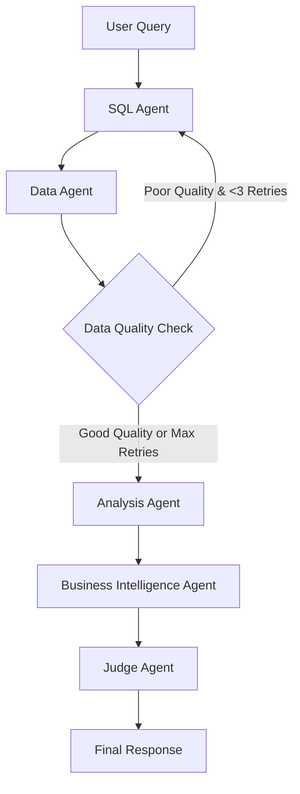

# TextLayer Financial Analysis System 

## 📋 Overview

This project is a **multi-agent financial analysis system** built with **Flask backend** and **Streamlit frontend**, using **LangGraph** for orchestrating multiple AI agents. The system provides enterprise-grade text-to-SQL capabilities with comprehensive business intelligence analysis.


## 🤖 LangGraph Multi-Agent Workflow

The system uses **LangGraph** to orchestrate a sophisticated multi-agent workflow:



### Agent Flow Steps:

1. ** SQL Agent** (`_sql_agent`)
   - Converts natural language to SQL
   - Uses comprehensive schema knowledge
   - Handles complex JOIN operations
   - Filters by account types (`AccountType = '1'` for revenue)
   - **NEW**: Enhanced retry context on subsequent attempts

2. ** Data Agent** (`_data_agent`)
   - Executes SQL queries against DuckDB
   - Processes and formats results
   - **NEW**: Performs data quality assessment
   - **NEW**: Detects errors, empty results, and data issues
   - Returns structured data for analysis

3. ** Conditional Retry Logic**
   - Automatically retries SQL generation if data quality is poor
   - Maximum of 3 retry attempts to prevent infinite loops
   - Provides enhanced context to SQL agent on retries
   - Continues with best available data after max retries

4. ** Analysis Agent** (`_analysis_agent`)
   - Performs statistical analysis on data
   - Identifies patterns and trends
   - Calculates key metrics and ratios
   - Provides quantitative insights

5. ** Business Intelligence Agent** (`_business_intelligence_agent`)
   - Generates business insights and recommendations
   - Assesses risks and opportunities
   - Provides strategic guidance
   - Creates executive-friendly summaries

6. ** Judge Agent** (`_judge_agent`)
   - Evaluates response quality (LLM-as-Judge)
   - Scores SQL, Analysis, and Business Insights (0-10)
   - Provides improvement feedback
   - Ensures high-quality outputs

## How to Run the Application

### Prerequisites
```bash
# Ensure you have Python 3.12 and pip installed
python3 --version
pip --version
```

### 1. Environment Setup
```bash

# Activate virtual environment
source .venv/bin/activate

# Install dependencies (if needed)
pip install -r requirements.txt
```

### 2. Environment Variables
```bash
# Set Doppler token (already configured in debug_flask.py)
export DOPPLER_TOKEN=dp.st.prd.ZSiWlMjSmwiSLkGWu5fwJOYstT9x1EgqVSMy8mIEYA6

# Or use the debug launcher which handles this automatically
```

### 3. Database Inspection (Optional)
```bash
# Inspect database structure
python inspect_database.py

```

### 4. Start the Flask API Server

```bash
# Start with Doppler secrets loading
python debug_flask.py
```

### Start Streamlit Dashboard
```bash
# In a new terminal
source .venv/bin/activate
streamlit run streamlit_app.py --server.port 8501
```
